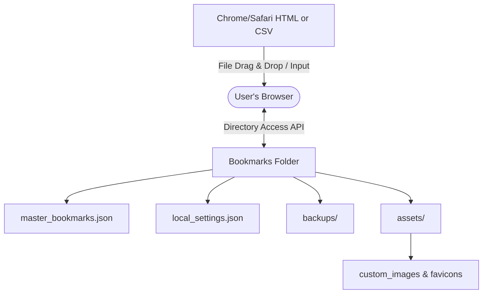

# Plan: Serverless, Local-First Bookmark & Link Manager

This plan outlines the architecture, data schemas, implementation steps, and specific developer prompts to build a bookmark manager that runs **100% in the browser** by opening a single HTML file directly (`file:///.../index.html`), with no local web server or background database processes required.

---

## 1. Architecture Overview

To achieve direct file persistence, asset storage, and absolute local control without running a local web server, the application is designed around the **Directory Access API**.



### Key Architectural Decisions
1. **Directory Access API**: The browser requests permission to access a local folder (e.g., `bookmarks-data/`).
   * **Structured Files**: Manages `master_bookmarks.json`, `local_settings.json`, and dated snapshots in a `/backups/` sub-directory.
   * **Local Image & Asset Storage**: Custom icons or images are saved into an `/assets/` subdirectory. When displaying cards, the app reads these images from the disk and converts them to temporary Object URLs (`URL.createObjectURL`).
2. **Universal Link Support**: Because the application runs under the browser's native local file protocol (`file:///.../index.html`), it has fewer security restrictions compared to sandboxed web servers. It can natively launch:
   * **Web Pages**: `https://...`, `http://...`
   * **Local Files & Folders**: `file:///C:/path/to/document.pdf` or `file:///Users/username/Projects` (supported because the host page is on the `file://` protocol).
   * **App Deep Links**: Custom schemes like `vscode://`, `obsidian://`, `spotify://`, `zoommtg://`, `slack://`, etc.
3. **No Auth & Zero-Installation**: Runs entirely on the local device, requiring no login or installation.

---

## 2. File Formats & Storage (Directory Approach)

### A. Master Config File (`master_bookmarks.json`)
The file contains rich bookmark metadata including custom colors, icon types, and custom protocols:

```json
{
  "version": 1,
  "categories": [
    {
      "id": "cat-dev-tools",
      "name": "Dev Tools",
      "icon": "Code",
      "color": "#6366f1",
      "bookmarks": [
        {
          "id": "link-github",
          "title": "GitHub",
          "url": "https://github.com",
          "description": "Code hosting",
          "tags": ["git", "dev"],
          "clicks": 42,
          "customStyle": {
            "cardColor": "#1e1e2e",
            "borderColor": "#89b4fa"
          },
          "icon": {
            "type": "lucide",
            "value": "Github"
          }
        },
        {
          "id": "link-local-project",
          "title": "Project Folder",
          "url": "file:///Users/username/Projects/Dashboard",
          "description": "Local workspace folder",
          "tags": ["local", "work"],
          "clicks": 15,
          "customStyle": {
            "cardColor": "#181825",
            "borderColor": "#a6e3a1"
          },
          "icon": {
            "type": "local-image",
            "value": "project-thumb.png"
          }
        }
      ]
    }
  ]
}
```

### B. Machine Settings File (`local_settings.json`)
Saves the specific layout overrides for this browser instance:

```json
{
  "theme": "glass-dark",
  "layout": {
    "gridColumns": 4,
    "categoryOrder": ["cat-dev-tools"],
    "hiddenCategories": []
  },
  "groups": [],
  "cardPositions": {}
}
```

---

## 3. Implementation Steps & Phases

### Phase 1: Directory Storage & File Handlers
* Set up a single-page React or Vanilla JS application.
* Implement the Directory Access API wrapper.
* Handle assets subdirectory (`/assets/`):
  * Write a function to save drag-and-dropped images or icons directly to the `/assets/` directory.
  * Load assets dynamically and map them to image tags.

### Phase 2: Core Frontend UI & Universal Launching
* Build a premium, glassmorphic card dashboard using CSS variables.
* Allow links to accept any text scheme (`file://`, `vscode://`, etc.) without standard URL input validation blocks.
* Enable fuzzy searching across URLs, tags, and custom metadata.

### Phase 3: Drag-and-Drop & Customization Modal
* Build a free-form **Draggable Canvas Layout** allowing users to drag cards anywhere and optionally group them visually.
* Build a **Card Editor Modal** allowing users to:
  * Select an icon (Lucide library search, external URL image, local favicon, or custom image upload).
  * Customize individual card background colors, borders, and text colors.
  * Set arbitrary parameters (like opening target, description notes).
* Implement **Master File Publishing**: Allow users to share personal categories directly to the master file from within the app.

### Phase 4: Security, Performance & Accessibility
* **Security**: Implement strict protection against Stored and DOM XSS vulnerabilities, particularly handling dynamic URL interpolations and protocol obfuscation (`javascript:`, `data:`). Ensure secure data-attribute handling for inline events.
* **Performance**: Optimize critical high-frequency rendering loops (like search result generation) by replacing intermediate array memory allocations with direct string concatenation.
* **Accessibility**: Enhance dynamic screen reader support using `aria-live` regions for status updates and empty states. Ensure forms are correctly labeled with matching `for` attributes.

### Phase 5: Import / Export & Master Publishing Module
* Build a parser to import standard HTML Netscape bookmarks files, CSVs, and JSONs.
* **Publish to Master**: Allow pushing individual bookmarks or entire categories directly to the shared `master_bookmarks.json` file. Prompt to delete local copies post-publish to avoid duplication.
* Support editing and publishing to a remote master file URL via HTTP PUT requests.

---

## 4. Prompts to Guide Claude

### Prompt 1: Browser-Direct Directory Picker, Local Assets, & Dual-File Persistence
```text
We want to build a local-first Bookmark and Link Manager that runs 100% in the browser by opening a local HTML file directly, without any web server.
Implement a helper class or Hook in React that manages persistence via directory access:
1. Directory Selector: Use the File System Access API (`window.showDirectoryPicker`) to let the user select a local folder (e.g., `bookmarks-data`).
2. Dual-File Handling: In that folder, read and write two separate files:
   - `master_bookmarks.json` (stores bookmarks, tags, categories, custom styling).
   - `local_settings.json` (stores local UI settings like themes, window layout, etc.).
3. Backups: Create a `/backups` subdirectory in the chosen folder. Every time changes are written, save a timestamped copy of the bookmarks file to prevent data loss.
4. Asset Storage (Local Images): Create an `/assets` subdirectory. When a user uploads a custom thumbnail or image for a bookmark card:
   - Save the image file directly to the `/assets` subdirectory on disk.
   - Cache it in application memory and generate a temporary Object URL (`URL.createObjectURL(file)`) so it can be rendered in the browser.
5. Reconnect Recovery: If browser storage is cleared, simply show a "Please select your bookmarks directory" button to link the application back to the existing files and local assets on disk.
```

### Prompt 2: Rich Link Cards with Custom Images/Icons & Universal Protocol Support
```text
Create a premium, dark-mode glassmorphism dashboard UI that works entirely static and supports highly customizable cards and link types.
- Link Types Support: Enable the card's URL property to launch any protocol:
  - Standard web links (https://...)
  - Local files and folders (file:///...) — Ensure this works natively without URL validation errors (which typically block local files on normal HTTP servers).
  - App-specific schemes (e.g., vscode://, obsidian://, spotify://, slack://).
- Item Customizability: Each bookmark item should support:
  - Custom card background color, border color, and border style.
  - Icon Type selection:
    - Includes toggle for Hide Icon feature.
    1. Lucide library icons (dynamic search list).
    2. Auto-fetched favicon (using `https://www.google.com/s2/favicons?domain=...` fallback).
    3. Custom Web Image URL.
    4. Uploaded local image (linked to the `/assets` directory, previewable in Asset Gallery).
- Layout: Render these custom styles natively on each card component. If a bookmark card has `file:///` scheme, show a unique "Local File" tag/indicator.
```

### Prompt 3: Card Customization Editor & Draggable Layout
```text
Add an interactive Card Customization Editor modal and implement layout dragging:
1. Card Editor Modal: When a user clicks "Edit" on any card, show a modal where they can:
   - Rename the bookmark, change the URL, edit description notes, and manage tags.
   - Set custom styles: Choose custom HSL/Hex colors for the card background, border, and text.
   - Upload a custom card thumbnail (saves to the `/assets/` directory) or select a Lucide icon.
2. Drag-and-Drop & Canvas Layout:
   - Users can drag cards to reposition them freely around the canvas layout.
   - Users can create resizable groups from the command palette and place cards within them.
3. Publishing: Allow users to publish entire personal categories to the shared master file directly from the category editor.
Save all modifications instantly back to the directory's files.
```

### Prompt 5: Import Engine (HTML/CSV/JSON)
```text
Build a parser utility in Javascript/TypeScript that runs entirely on the client-side:
1. HTML Bookmark Importer: Parse the standard Chrome/Safari bookmark export format (Netscape HTML). Recursively traverse the `<DL>` and `<DT>` tags to extract folders as Categories and `<A>` links as Bookmarks.
2. CSV/JSON Importer: Provide templates and parsing logic for CSV and JSON files.
3. Duplication Resolution UI: If an imported URL already exists in the current bookmarks list, display a modal showing the duplicate, prompting the user to either "Keep Existing", "Overwrite with Import", or "Merge Tags & Description".
```

---

## 5. Potential Enhancements & Future Features

Consider adding these advanced features to further elevate the user experience and customizability:

### A. Vercel/Linear Style Command Palette (`Ctrl + K` or `Cmd + K`)
Allow power users to navigate the app, switch themes, search bookmarks, filter tags, and execute quick actions purely from the keyboard.
* *Example prompt:* `Implement a keyboard-accessible search palette that overlays the dashboard when Cmd/Ctrl + K is pressed, allowing instant navigation, tag toggling, and page configuration.`

### B. Drag & Drop Directory Scanning
Enable dropping a folder from the local computer filesystem directly onto the webpage. The app scans the directory contents recursively and automatically adds all files (PDFs, images, documents) as `file://` bookmark cards.

### C. Expandable Markdown Notes (Knowledge Card)
Turn bookmark cards into mini-wikis. Clicking a card can open a slide-over panel displaying a rich text editor supporting Markdown, checklist items, and internal wiki-style links.

### D. Single-File Build Bundler (Self-Contained)
Write a build script (e.g., using `vite-plugin-singlefile`) that bundles all CSS, JS, SVGs, and libraries directly into one single `.html` file. This lets the user carry around a single self-contained application file.

### E. Quick-Add Bookmarklet
Provide a simple javascript-based "Add Bookmark" bookmarklet that users can drag to their browser's bookmark bar. Clicking it on any web page automatically copies a correctly structured JSON snippet to their clipboard or pre-populates a "Quick Add" box when they open the dashboard.

### F. Ideas and Enhancements
Future ideas and enhancements are tracked in the `Ideas and Enhancements.md` file.
